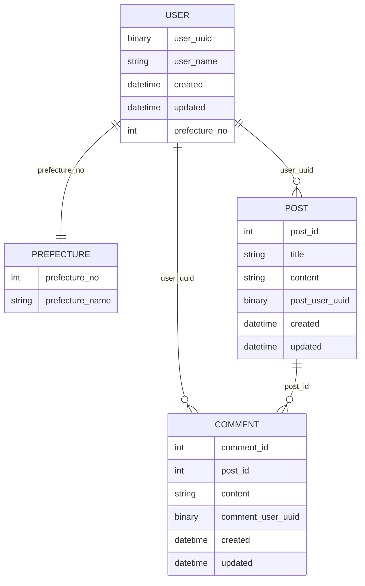

## 概要
MySQLでダミーデータを使って試すリポジトリ

## データ作成

```
docker compose run app bash
pip install faker
cd  /docker-entrypoint-initdb.d
python create_data.py > 01_dump.sql
```

## DB起動

```
docker compose up -d
```

## phpmyadmin

- http://localhost:8057
- http://localhost:8080

## ER図

